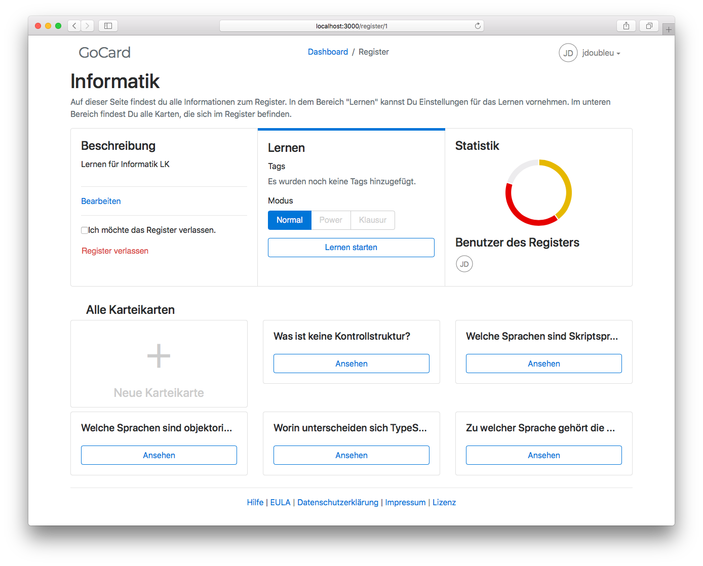

# GoCard
GoCard is a learning platform based on an indexed cards system.

## State
This project should **not** be used in production!
It has serious security issues and many bugs due to the unfinished state.

There is no active development. However if you want to continue working on this project feel free to fork it or contact me for help.

## Architecture
The **client** is a single-page application written in JavaScript using [ReactJS](https://reactjs.org/).
It communicates with a _REST_ API written in PHP using the [Flow Framework](https://flow.neos.io/).

## Motivation
We implemented this software as a project in our study computer science.

## Contribution
Feel free to contribute in any kind.
Thank you for your time!

## Development
Run both `composer install` and `npm install` inside the root directory to install all required dependencies.

If you have [ddev](https://github.com/drud/ddev) installed you can run `ddev start` to start the API.
Then execute `ddev exec ../flow doctrine:migrate` to run migrations.

To start the client you only have to run `npm start` once.
